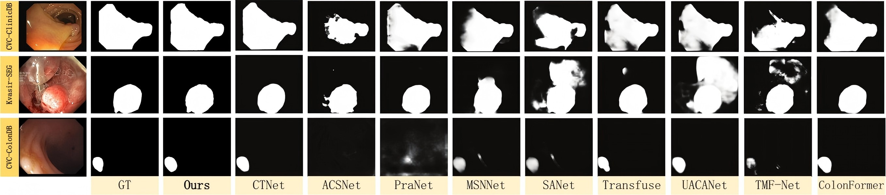
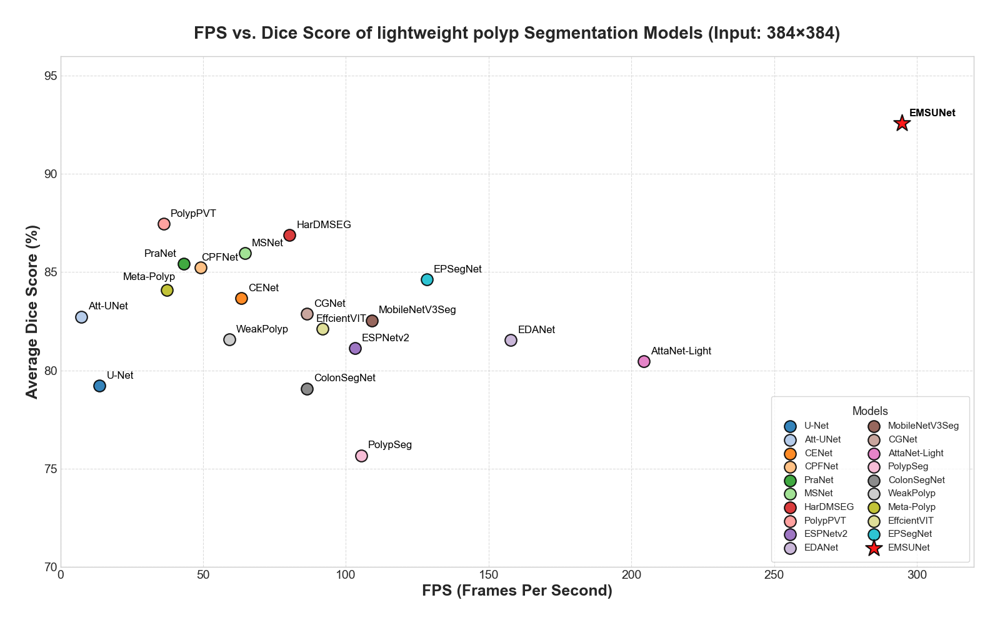

# EMSUNet:An ultra-lightweight network for real-time polyp segmentation


## Architecture
<p align="center">

</p>

## Abstract
Colorectal cancer prevalence necessitates efficient polyp detection and removal, yet current high-precision segmentation methods suffer from computational complexity while lightweight models sacrifice accuracy.Given the critical need for computational efficiency in medical image segmentation, this paper introduces an innovative S-M-C-A concept (Channel Split, Dimension Elevation, Multi-Scale DWConv, Attention, Dimension Reduction). This method exploits channel redundancy to transform single-scale depthwise convolution into multi-scale through splitting, thereby learning diverse multi-scale features to enhance performance. It also employs attention mechanisms to weight scales, thereby boosting representational capacity while minimizing the number of required layers. The SMCA approach concurrently improves performance and reduces parameter count.Building on the SMCA framework, we propose EMSUet for real-time polyp segmentation. Its superior computational efficiency surpasses that of all recent polyp segmentation models.The base model presented in this paper is structurally optimized for polyp segmentation tasks, attaining a Dice score of 93.19\%, which is remarkably close to the state-of-the-art (SOTA) performance on the Kvasir dataset. EMSUNet effectively resolves the "lightweight-accuracy" paradox, delivering a lightweight solution (1.3 GFlops), high accuracy (94.1\% Dice on CVC-ClinicDB), and real-time performance (300 fps on RTX 4060).
## Usage:
### Recommended environment:
**Please run the following commands.**
```
conda create -n EMSUNet python=3.8
conda activate EMSUNet

pip install torch==1.11.0+cu113 torchvision==0.12.0+cu113 torchaudio==0.11.0 --extra-index-url https://download.pytorch.org/whl/cu113

pip install -r requirements.txt

```


## Quantitative Results:

<p align="center">

</p>
<p align="center">

</p>

## Data preparation:

- Kvasir-SEG: [here](https://datasets.simula.no/kvasir-seg/). 
- CVC-ClinicDB: [here](https://polyp.grand-challenge.org/CVCClinicDB/). 
- ETIS-LaribpolypDB: [here](https://drive.google.com/drive/folders/10QXjxBJqCf7PAXqbDvoceWmZ-qF07tFi?usp=share_link). 
- CVC-ColonDB: [here](https://drive.google.com/drive/folders/1-gZUo1dgsdcWxSdXV9OAPmtGEbwZMfDY?usp=share_link).

 Train/Test datasets seperated by Pranet:
- [Google Drive Link (327.2MB)](https://drive.google.com/file/d/1Y2z7FD5p5y31vkZwQQomXFRB0HutHyao/view?usp=sharing). It contains five sub-datsets: CVC-300 (60 test samples), CVC-ClinicDB (62 test samples), CVC-ColonDB (380 test samples), ETIS-LaribPolypDB (196 test samples), Kvasir (100 test samples).
    
- [Google Drive Link (399.5MB)](https://drive.google.com/file/d/1YiGHLw4iTvKdvbT6MgwO9zcCv8zJ_Bnb/view?usp=sharing). It contains two sub-datasets: Kvasir-SEG (900 train samples) and CVC-ClinicDB (550 train samples).

## Pretrained model:
All the pre-trained models in this paper have been packaged together with the code, and the weights and results have been placed in the `pretrained_pth` folder.The code, weights, logs, and architecture diagram for the customized model are placed in the `EMSUNet_cool` folder..


## Acknowledgement:

We are very grateful to our predecessors for their contributions to lightweight polyp segmentation networks, which have provided the basis for our framework!
